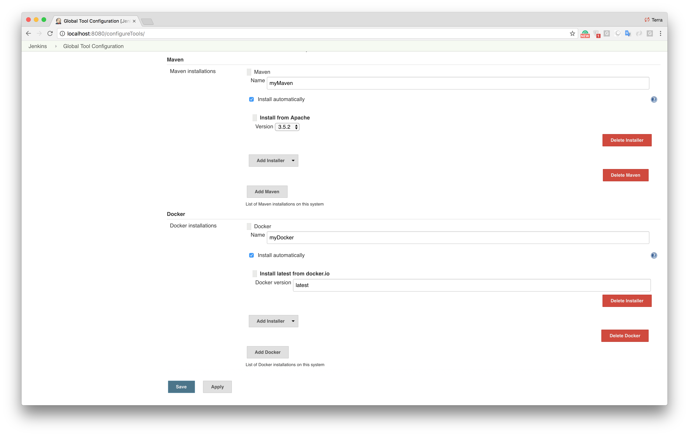
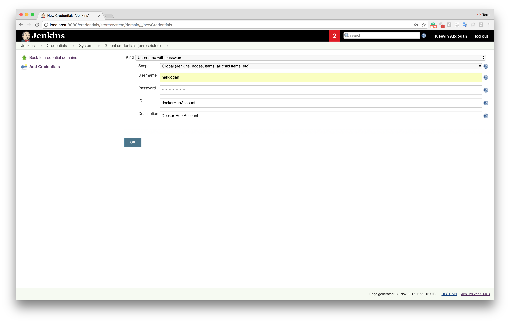
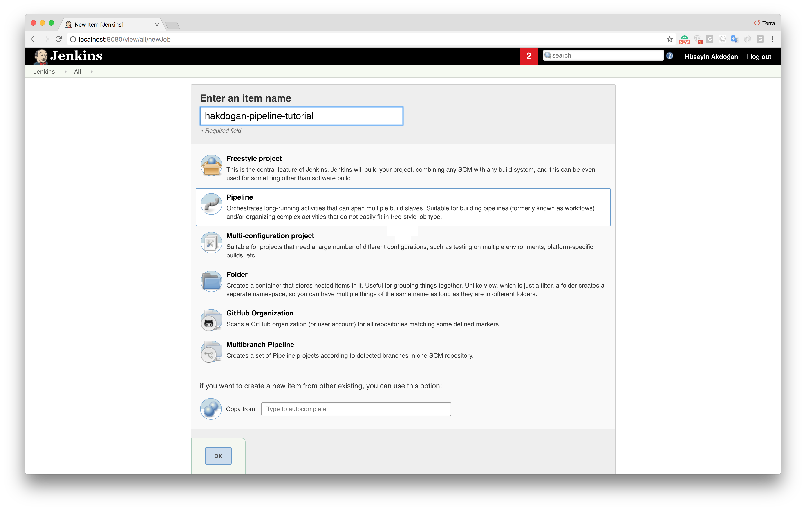

[](https://github.com/igrigorik/ga-beacon)

# A tutorial about Continuous Integration and Continuous Delivery by Dockerize Jenkins Pipeline

This repository is a tutorial on the automatically management of processes such as application build, test, deploy, getting a code quality report, docker image build, image push to the Docker Hub etc with Jenkins Pipeline which is run on a Docker container. Our goal is to ensure ``Continuous Integration`` and ``Continuous Delivery`` by triggering the pipeline after each push.

That processes we want to auto-manage
* Code checkout
* Run tests
* Compile the code
* Run Sonarqube analysis on the code
* Create Docker image
* Push the image to Docker Hub
* Pull and run the image

## First step, run up containers

Since one of the goals is to obtain the ``sonarqube`` report of our project, we should be able to access sonarqube from dockerize jenkins. For this reason, we will use ``docker compose``.

``docker-compose.yml``
```yml
version: '3.2'
services:
  sonarqube:
    build:
      context: sonarqube/
    ports:
      - 9000:9000
      - 9092:9092
    container_name: sonarqube
  jenkins:
    build:
      context: jenkins/
    privileged: true
    user: root
    ports:
      - 8080:8080
      - 50000:50000
    container_name: jenkins
    volumes:
      - /tmp/jenkins:/var/jenkins_home #Remember that, the tmp directory is designed to be wiped on system reboot.
      - /var/run/docker.sock:/var/run/docker.sock
    depends_on:
      - sonarqube
```

Paths of docker files of the containers are specified at context attribute in the docker-compose file. Content of these files as follows.

``sonarqube/Dockerfile``
```
FROM sonarqube:6.7-alpine
```

``jenkins/Dockerfile``
```
FROM jenkins:2.60.3
```

If we run the following command in the same directory as the ``docker-compose.yml`` file, the Sonarqube and Jenkins containers will run up.

```
docker-compose -f docker-compose.yml up --build
```

```
docker ps

CONTAINER ID        IMAGE                COMMAND                  CREATED              STATUS              PORTS                                              NAMES
87105432d655        pipeline_jenkins     "/bin/tini -- /usr..."   About a minute ago   Up About a minute   0.0.0.0:8080->8080/tcp, 0.0.0.0:50000->50000/tcp   jenkins
f5bed5ba3266        pipeline_sonarqube   "./bin/run.sh"           About a minute ago   Up About a minute   0.0.0.0:9000->9000/tcp, 0.0.0.0:9092->9092/tcp     sonarqube
```

## GitHub configuration
We'll define a service on Github to call the ``Jenkins Github`` webhook because we want to trigger the pipeline we will define whenever a push is made to our repository. To do this go to **Settings -> integrations & Services.** The ``Jenkins Github plugin`` should be shown on the list of available services as below.


After this, we should be define our access URL of dockerize Jenkins container as **Jenkins URL** by adding ``/github-webhook/`` and add a new service.


The next step is that create an ``SSH key`` for Jenkins user and define it as a ``Deploy keys`` on our GitHub repository.


When the steps are taken correctly, the following connection request should return a result like this.
```
ssh git@github.com
PTY allocation request failed on channel 0
Hi <your github username>/<repository name>! You've successfully authenticated, but GitHub does not provide shell access.
Connection to github.com closed.
```

## Jenkins configuration

We have configured Jenkins int the docker compose file to run on 8080 HTTP port therefore if we visit http://localhost:8080 we will be greeted by a screen like this.


We need the admin password to proceed to installation. It's stored ``/var/jenkins_home/secrets/initialAdminPassword`` directory and also written as output on the console when Jenkins run up.

```
jenkins      | *************************************************************
jenkins      |
jenkins      | Jenkins initial setup is required. An admin user has been created and a password generated.
jenkins      | Please use the following password to proceed to installation:
jenkins      |
jenkins      | 45638c79cecd4f43962da2933980197e
jenkins      |
jenkins      | This may also be found at: /var/jenkins_home/secrets/initialAdminPassword
jenkins      |
jenkins      | *************************************************************
```

To access the password from the container.

```
docker exec -it jenkins sh
/ $ cat /var/jenkins_home/secrets/initialAdminPassword
```

After entering the password, we will be download recommended plugins and define ``admin user``.


After clicking **Save and Finish** and **Start using Jenkins** buttons, we should be seeing the Jenkins homepage. One of the seven goals listed above is that we should be docker image building in dockerize Jenkins. Please look at the volume definitions for Jenkins in the compose file.
```
- /var/run/docker.sock:/var/run/docker.sock
```

The purpose here is to communicate between the ``Docker Daemon`` and the ``Docker Client``(_we will install it on the Jenkins_) over the socket. Like the docker client, we also need ``Maven`` to compile the application to be checked out. For the installation of these tools, we need to perform ``Maven`` and ``Docker Client`` installs under _Manage Jenkins -> Global Tool Configuration_ menu.



We added Maven and Docker installer and checked ``Install automatically`` checkbox. These tools are installed by Jenkins when our script(_Jenkins file_) first runs. We give ``myMaven`` and ``myDocker`` names to the tools. We will access these tools with this names in the script file.

Since we will perform some operations such as ``checkout`` and ``push image to Docker Hub`` on the script file, We need to define the ``Docker Hub Credentials`` and if _we are using a **private repo**, in addition, we must define ``Github credentials``.
These definitions are performed under _Jenkins Home Page -> Credentials -> Global credentials (unrestricted) -> Add Credentials_ menu.



We will use the value we entered in the ``ID`` field to Docker Login in the script file. Now, we define pipeline under _Jenkins Home Page -> New Item_ menu.



In this step, we select ``GitHub hook trigger for GITScm pooling`` options for automatic run of the pipeline by ``Github hook`` call.


Also in Pipeline section, we ``select Pipeline script from SCM`` as Definition, define GitHub repository and branch, and specify script location(_Jenkins file_).


After that, when a push is done to the remote repository or when you manually trigger the pipeline by ``build now`` option, the steps described in Jenkins file will be executed.


## Review important points of the Jenkins file

```
stage('Initialize'){
    def dockerHome = tool 'myDocker'
    def mavenHome  = tool 'myMaven'
    env.PATH = "${dockerHome}/bin:${mavenHome}/bin:${env.PATH}"
}
```

The ``Maven`` and ``Docker client`` tools we have defined in Jenkins under _Global Tool Configuration_ menu are added to the ``PATH environment variable`` for using these tools with ``sh command``.

```
stage('Push to Docker Registry'){
    withCredentials([usernamePassword(credentialsId: 'dockerHubAccount', usernameVariable: 'USERNAME', passwordVariable: 'PASSWORD')]) {
        pushToImage(CONTAINER_NAME, CONTAINER_TAG, USERNAME, PASSWORD)
    }
}
```

``withCredentials`` provided by ``Jenkins Credentials Binding Plugin`` and bind credentials to variables. We passed **dockerHubAccount** value with ``credentialsId`` parameter. Remember that, dockerHubAccount value is Docker Hub credentials ID we have defined it under _Jenkins Home Page -> Credentials -> Global credentials (unrestricted) -> Add Credentials_ menu. In this way, we access to username and password information of the account for login.

## Sonarqube configuration

For ``Sonarqube`` we have made the following definitions in the ``pom.xml`` file of the project.

```xml
<sonar.host.url>http://sonarqube:9000</sonar.host.url>
...
<dependencies>
...
    <dependency>
        <groupId>org.codehaus.mojo</groupId>
        <artifactId>sonar-maven-plugin</artifactId>
        <version>2.7.1</version>
        <type>maven-plugin</type>
    </dependency>
...
</dependencies>
```

In the docker compose file, we gave the ``sonarqube`` name to the Sonarqube container, so in the pom.xml file the sonar URL was defined as http://sonarqube:9000.